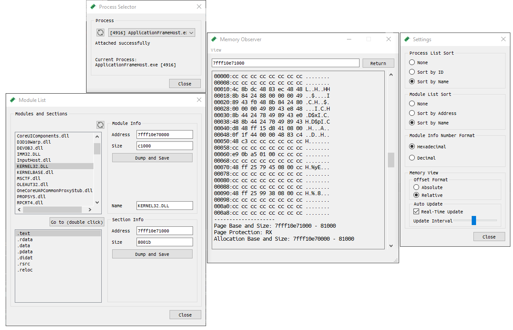

# Memory Observer
## Description
MemObserver is a tool designed for inspecting and monitoring the memory of running processes on a Windows OS. It can be useful for developers for debugging or security researchers to inspect memory of a malicious programs.

#### Key Features:
- Process Memory Inspection: View and analyze the memory of almost any running process.
- Module Exploration: List and explore the modules loaded by a process.
- Module and Section Dumping: Dump modules or their sections for detailed dynamic analysis.
- User-Friendly Interface: Intuitive and straightforward interface for easy navigation and operation.  
*Note:* This project relies on the Windows API to access process memory, so it wouldn't be able to access protected process's memory. However, you may add your own interface for reading/writing process memory: check [advanced usage](#Advanced-Usage).
## Table of Contents:
1. [Build](#Build)
2. [Configurations](#Configurations)
3. [Advanced Usage](#Advanced-Usage)
## Build
Before you begin, make sure you have met the following requirements:
- OS: Windows 10 or later
- Qt Creator: Download and install Qt Creator from [official Qt website](https://www.qt.io/).
- CMake: The project uses this build system.  
Remark: Currently, building the project has only been tested using Qt Creator.
### Steps
1. Download and install Qt Creator.
2. Clone the repository using `git clone https://github.com/kvakazabra/memObserver.git`
3. Open the project in Qt Creator: navigate to the cloned `memObserver` and open the `CMakeLists.txt` file.
4. Build and run the project using Qt Creator's interface (or press Ctrl+R).
## Configurations
MemObserver can be built and run in two different configurations listed below.
#### Release
- Regular build intended for regular use.
#### Debug
- Provides a console where additional debug messages are displayed.
### Advanced Usage
- Custom Interfaces: While the project relies on the Windows API to access memory, if the limitations are unsuitable for you, you may add your own interface for reading/writing process memory.  
  Check the `IProcessIO` interface class in `./process.h` and modify the `CProcessSelector` class in `./process_selector.h` to integrate your custom implementation.
